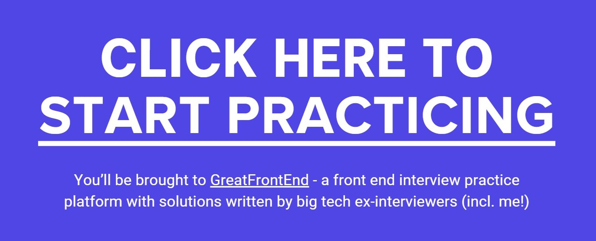

  <h1>Front End Interview Handbook</h1>
  
By <a href="https://www.greatfrontend.com/?utm_source=github&utm_medium=referral&gnrs=frontendinterviewhandbook">GreatFrontEnd</a>

  
   
  <h3>
    <a href="https://www.frontendinterviewhandbook.com">Read on the website</a>
  </h3>
  

    Join/follow us on <a href="https://linkedin.com/company/greatfrontend" target="_blank">LinkedIn</a> | <a href="https://discord.gg/NDFx8f6P6B" target="_blank">Discord</a> | <a href="https://x.com/greatfrontend" target="_blank">𝕏 (Twitter)</a> | <a href="https://facebook.com/greatfrontend" target="_blank">Facebook</a>
  

---

## What is this?

Unlike typical software engineer job interviews, front end job interviews have less emphasis on algorithms and have more questions on intricate knowledge and expertise about the domain — HTML, CSS, JavaScript, just to name a few areas. This repository covers all you need to know for front end interviews:

- [Various formats of Front end interviews](https://www.frontendinterviewhandbook.com/introduction/) including formats by different companies
- [Front end system design interviews](https://www.frontendinterviewhandbook.com/front-end-system-design/)
- [Front end trivia questions](https://www.frontendinterviewhandbook.com/trivia/) - answers to the h5bp Front-end Developer Interview Questions
- [Front end questions](https://www.frontendinterviewhandbook.com/coding/javascript-utility-function/) - JavaScript, DOM, algorithms, and more
- [Front end interview questions by companies](https://www.frontendinterviewhandbook.com/company-interview-questions/)

## Where to get hands on practice?

  

After getting a good understanding about front end interview preparation, try out [GreatFrontEnd](https://www.greatfrontend.com?utm_source=github&utm_medium=referral&gnrs=frontendinterviewhandbook), a platform built by me! Not only are there 200+ practice questions, each with multiple solutions from Senior Front End Engineers, there are also automated test case suites to help you identify what's wrong with your code. Thus, check out the following resources:

- [Study plans](https://www.greatfrontend.com/study-plans?utm_source=github&utm_medium=referral&gnrs=frontendinterviewhandbook) help you prepare for your upcoming technical interviews, whether it is in a week or 3 months later.
- [Focus areas](https://www.greatfrontend.com/focus-areas?utm_source=github&utm_medium=referral&gnrs=frontendinterviewhandbook) allow you to focus on your weak areas and also further improve your strengths depending on your preferences.
- [Preparation by stage](https://www.greatfrontend.com/prepare?utm_source=github&utm_medium=referral&gnrs=frontendinterviewhandbook) prepares you for each phase of your interview process, from quiz to coding interviews.
- [Individual framework questions](https://www.greatfrontend.com/questions?utm_source=github&utm_medium=referral&gnrs=frontendinterviewhandbook) offer training based on specific frameworks that may be tested during your technical interviews.

---

  <h3>Need to practice front end interview questions? <a href="https://www.greatfrontend.com?utm_source=github&utm_medium=referral&gnrs=frontendinterviewhandbook">GreatFrontEnd</a> is holding a limited time promotion for 20% off their lifetime plan of high quality practice questions and reference solutions written by ex-FAANG interviewers 🚀</h3>

---

## Looking for Generic Interview Preparation?

You might be interested in the [Tech Interview Handbook](https://www.techinterviewhandbook.org) which has helpful content on general coding interviews such as algorithms, behavioral questions and an [interview cheatsheet](https://www.techinterviewhandbook.org/coding-interview-cheatsheet/)!

  
   
  

    <em>Credits: Illustration by <a href="https://undraw.co/">unDraw</a></em>
  

  <h3>
    <a href="https://www.techinterviewhandbook.org/">Read on the website</a>
  </h3>

## Translations

- [English](https://www.frontendinterviewhandbook.com)
- [Chinese (Simplified) (简体中文)](https://www.frontendinterviewhandbook.com/zh/javascript-questions/)
- [Japanese (日本語)](https://www.frontendinterviewhandbook.com/jp/javascript-questions/)
- [Korean (한국어)](https://www.frontendinterviewhandbook.com/kr/javascript-questions/)
- [Polish (Polski)](https://www.frontendinterviewhandbook.com/pl/javascript-questions/)
- [Portuguese (Português)](https://www.frontendinterviewhandbook.com/pr/javascript-questions/)
- [Russian (Русский)](https://www.frontendinterviewhandbook.com/ru/javascript-questions/)
- [Tagalog](https://www.frontendinterviewhandbook.com/tl/javascript-questions/)

## Related

If you are interested in how data structures are implemented, check out [Lago](https://github.com/yangshun/lago), a Data Structures and Algorithms library for JavaScript. It's meant for reference and studying purposes, not for production use.

## Contributing

### Contributing Guide

Read our [contributing guide](/CONTRIBUTING.md) to learn about how you can contribute, how to propose improvements or if you are interested in translating the content.

### Supporting

Many hours of hard work have gone into this project. Your support will be very appreciated!

## License

All projects and packages in this repository are [MIT licensed](/LICENSE).
