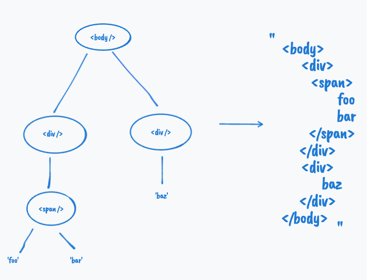

import MDXCodeBlock from 'MDXCodeBlock';

import serializeHTMLJs from '../setup/src/html-serializer.js';
import serializeHTMLTs from '../setup/src/html-serializer.ts';

This seems like an unusual question because normally we don't programmatically generate HTML strings from an object. We normally just write JSX or other template syntax and let Prettier do the formatting.

{/* TODO: Fix illustration  */}

## Solution

Let's work backward from the desired output. In order to form such an output string, we need a way to collect all the information about this DOM tree and organize them to the desired format. And in order to acquire the info about each node, we need to visit them one by one, i.e. traversing the object. Effectively, we can split the task into two sub-tasks:

1. Traverse the object recursively.
1. Extract and organize the info to form the output.

There are two ways to traverse a tree - Depth-first search and Breadth-first search. If you have taken data structure courses on Trees before, you should be really familiar with these two approaches. If you don't know know that much, don't worry. Let's first take a step back and observe the `tree` object. We can see that each object has a similar structure and there is a pattern - items in the `children` property look like its parent, with the exception that some items in `children` are strings, representing a leaf text node in typical DOM trees. Whenever we see a pattern like this, we should immediately think of recursion. Not to say recursion is the only and best way to solve problems like this, but it usually is a good place to start looking.

```js
const tree = {
  tag: 'body',
  children: [
    { tag: 'div', children: [{ tag: 'span', children: ['foo', 'bar'] }] },
    { tag: 'div', children: ['baz'] },
  ],
};
```

Let's continue on the traversing part. As we have discussed, we would want to use recursion to process the `tree` object. And it is easy to tell when we should stop recursion for a given input: if the input has a `children` property, we keep on exploring the tree by calling the function itself on the items in `children`; otherwise, we know we are at the leaf node and we should stop and return the input (i.e. the `string`).

```js
function traverse(input) {
  // Every recursion needs a base case.
  if (!input.children) {
    return input;
  }

  // Loop through every child.
  for (const child of input.children) {
    // Recurse into each child via traverse(child)
  }
}
```

We figured out roughly how we want to traverse the `tree` object so we can visit every node in the tree. Let's move on to what we need to do exactly on every node.

For a leaf text node, all we need to do is to return the string as-is. For a host node with `children`, we need to get its tag name, put it into an open and closing tag, and wrap that around its children. For example, for `{ tag: 'span', children: ['bar1', 'bar2'] }`, the output would be:

```js
`<span>
  bar1
  bar2
</span>`;
```

Note that we probably don't want to manipulate the strings directly during each visit as the code can get really hairy. Instead, we can first store each line of the output string in an array, i.e. `['<span >', ' bar1', ' bar2', '</span>']` and concatenate them via `join('\n')` before returning.

Here is an initial but incomplete solution:

```js
function serializeHTML(root) {
  function traverse(root) {
    return root.children
      ? [`<${root.tag}>`, ...root.children.flatMap(traverse), `</${root.tag}>`]
      : root;
  }

  return traverse(root).join('\n');
}
```

It might look very terse to you but if you take a closer look at it, you would realize that it is doing exactly what is described above. We simply replaced the `if` statement with a ternary operator `? ... : ...` and `for ... of` statement with a `flatMap`. You might not be familiar with `flatMap` but it is basically `map` that automatically concatenate/flatten every sub-array items in the resulting array.

However this solution is not complete because it doesn't indent the output string properly. Here is the output we get with our current solution by passing the `tree` object to it:

```js
`<body>
<div>
<span>
bar
bar2
</span>
</div>
<div>
baz
</div>
</body>`;
```

We can tell that the level of indentation is dictated by the current depth of recursion. One way to achieve that is to pass a depth argument to the recursion call which increments by 1 after going one level deeper into the recursion call stack. While we are at it, we can also parameterize the character for indentation so the user can choose to indent by one tab or spaces.

Here is the final solution:

<MDXCodeBlock languages={{ jsx: serializeHTMLJs, tsx: serializeHTMLTs }} />

## Edge cases

- The solution doesn't works with DOM trees that only contain text nodes.
