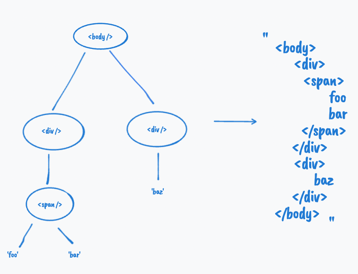

import MDXCodeBlock from 'MDXCodeBlock';

import serializeHTMLJs from '../setup/src/html-serializer.js';
import serializeHTMLTs from '../setup/src/html-serializer.ts';

这似乎是一个不寻常的问题，因为通常我们不会通过编程方式从对象生成 HTML 字符串。我们通常只编写 JSX 或其他模板语法，然后让 Prettier 进行格式化。

{/* TODO: 修复插图  */}

## 解决方案

让我们从所需的输出开始倒推。为了形成这样的输出字符串，我们需要一种方法来收集关于这个 DOM 树的所有信息，并将它们组织成所需的格式。为了获取关于每个节点的信息，我们需要逐个访问它们，即遍历对象。实际上，我们可以将任务分成两个子任务：

1. 递归遍历对象。
2. 提取并组织信息以形成输出。

有两种方法可以遍历树——深度优先搜索和广度优先搜索。如果你之前上过关于树的数据结构课程，你应该对这两种方法非常熟悉。如果你不太了解，别担心。让我们先退一步，观察一下 `tree` 对象。我们可以看到每个对象都有一个相似的结构，并且有一个模式——`children` 属性中的项目看起来像它的父级，除了 `children` 中的某些项目是字符串，表示典型 DOM 树中的叶文本节点。每当我们看到这样的模式时，我们应该立即想到递归。并不是说递归是解决这类问题的唯一和最佳方法，但它通常是一个很好的开始。

```js
const tree = {
  tag: 'body',
  children: [
    { tag: 'div', children: [{ tag: 'span', children: ['foo', 'bar'] }] },
    { tag: 'div', children: ['baz'] },
  ],
};
```

让我们继续遍历部分。正如我们所讨论的，我们希望使用递归来处理 `tree` 对象。并且很容易判断何时应该停止给定输入的递归：如果输入具有 `children` 属性，我们通过在 `children` 中的项目上调用函数本身来继续探索树；否则，我们知道我们位于叶节点，我们应该停止并返回输入（即 `string`）。

```js
function traverse(input) {
  // 每次递归都需要一个基本情况。
  if (!input.children) {
    return input;
  }

  // 循环遍历每个子节点。
  for (const child of input.children) {
    // 通过 traverse(child) 递归到每个子节点
  }
}
```

我们大致了解了我们希望如何遍历 `tree` 对象，以便我们可以访问树中的每个节点。让我们继续讨论我们需要在每个节点上确切地做什么。

对于叶文本节点，我们需要做的就是原样返回字符串。对于带有 `children` 的宿主节点，我们需要获取其标签名称，将其放入一个开始标签和结束标签中，并将该标签包裹在其子节点周围。例如，对于 `{ tag: 'span', children: ['bar1', 'bar2'] }`，输出将是：

```js
`<span>
  bar1
  bar2
</span>`;
```

请注意，我们可能不想在每次访问期间直接操作字符串，因为代码可能会变得非常复杂。相反，我们可以首先将输出字符串的每一行存储在一个数组中，即 `['<span >', ' bar1', ' bar2', '</span>']`，然后在返回之前通过 `join('\n')` 将它们连接起来。

这是一个最初但未完成的解决方案：

```js
function serializeHTML(root) {
  function traverse(root) {
    return root.children
      ? [`<${root.tag}>`, ...root.children.flatMap(traverse), `</${root.tag}>`]
      : root;
  }

  return traverse(root).join('\n');
}
```

它看起来可能很简洁，但如果你仔细观察它，你会意识到它正在做上面描述的完全相同的事情。我们只是用三元运算符 `? ... : ...` 替换了 `if` 语句，并用 `flatMap` 替换了 `for ... of` 语句。你可能不熟悉 `flatMap`，但它基本上是 `map`，它会自动连接/展平结果数组中的每个子数组项。

但是，此解决方案不完整，因为它没有正确缩进输出字符串。这是我们使用当前解决方案通过将 `tree` 对象传递给它而获得的输出：

```js
`<body>
<div>
<span>
bar
bar2
</span>
</div>
<div>
baz
</div>
</body>`;
```

我们可以看出，缩进的级别是由当前的递归深度决定的。实现这一点的一种方法是将一个深度参数传递给递归调用，该参数在进入递归调用堆栈的更深一层后递增 1。同时，我们还可以参数化缩进字符，以便用户可以选择通过一个制表符或空格进行缩进。

这是最终的解决方案：

<MDXCodeBlock languages={{ jsx: serializeHTMLJs, tsx: serializeHTMLTs }} />

## 边缘情况

* 该解决方案不适用于仅包含文本节点的 DOM 树。
